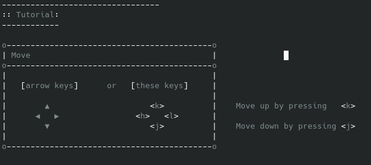

GRED - Grid-based text Editor.
See LICENSE file for copyright and license details.

Minimal text editor (configured via the source code).

All code is thoroughly commented (~25% of the lines are comments).

See /guide for a walkthrough on tinkering with gred.

GRED has a user-friendly tutorial. Press -?- to open it.
